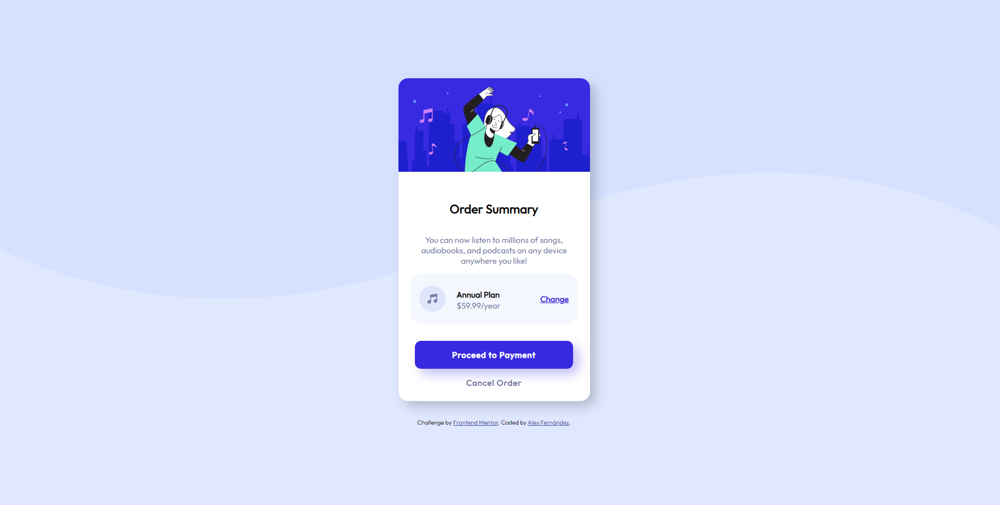

# Frontend Mentor - Order summary card solution

This is a solution to the [Order summary card challenge on Frontend Mentor](https://www.frontendmentor.io/challenges/order-summary-component-QlPmajDUj). Frontend Mentor challenges help you improve your coding skills by building realistic projects. 

## Table of contents

- [Overview](#overview)
  - [The challenge](#the-challenge)
  - [Screenshot](#screenshot)
  - [Links](#links)
- [My process](#my-process)
  - [Built with](#built-with)
  - [What I learned](#what-i-learned)
- [Author](#author)

**Note: Delete this note and update the table of contents based on what sections you keep.**

## Overview

### The challenge

Users should be able to:

- See hover states for interactive elements

### Screenshot

### Links

- Solution URL:(https://github.com/Arekkusu17/Order-summary-card-coding-challenge)
- Live Site URL: (https://arekkusu17.github.io/Order-summary-card-coding-challenge/)

## My process

### Built with

- Semantic HTML5 markup
- CSS custom properties
- Flexbox
- CSS Grid

### What I learned

The more i attempt this kind of challenges, i feel like it's easier to work with Flexbox and CSS. Everytime I learn more properties or "tricks" to understand and a use better approachs to achieve the goal.

## Author

- Frontend Mentor - (https://www.frontendmentor.io/profile/Arekkusu17)

